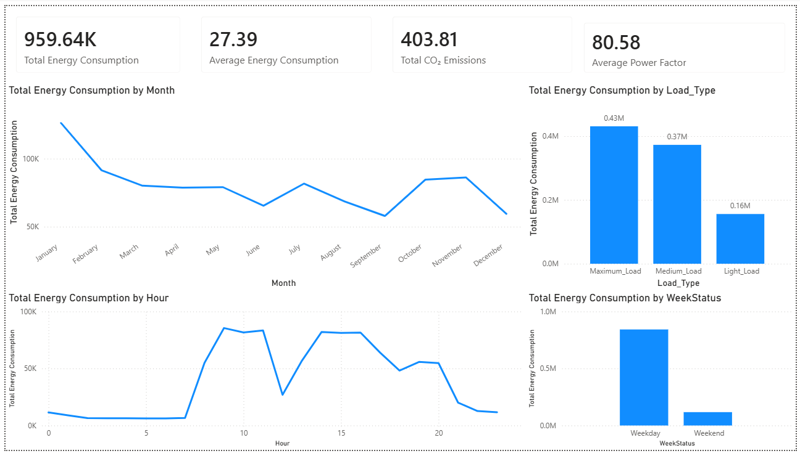

# Industrial Energy Consumption Analytics

## Project Overview

An end-to-end data analytics project analyzing industrial energy consumption data to identify consumption patterns, operational trends, load characteristics, and key energy performance indicators.

The project combines Python-based exploratory data analysis, SQL business analysis, and an interactive Power BI dashboard to convert raw energy data into actionable insights.

---

## Business Objectives

The analysis aims to answer key operational questions:

- How does energy consumption vary across months?
- Which load type contributes the most to total energy consumption?
- What are the peak energy consumption hours?
- How does energy consumption differ between weekdays and weekends?
- What are the overall CO₂ emissions and power factor levels?
- Which operational patterns may require further investigation?

---

## Dataset

The dataset contains more than 35,000 industrial energy consumption records.

Key attributes include:

- Date and time
- Energy consumption
- CO₂ emissions
- Power factor
- Load type
- Weekday/weekend status
- Hour
- Month

---

## Tools & Technologies

- Python
- Pandas
- NumPy
- MySQL
- SQL
- Power BI
- Jupyter Notebook
- Git & GitHub

---

## Project Workflow

```text
Raw Dataset
     ↓
Data Cleaning
     ↓
Data Transformation
     ↓
Exploratory Data Analysis
     ↓
SQL Business Analysis
     ↓
KPI Development
     ↓
Power BI Dashboard
     ↓
Business Insights
     ↓
Recommendations
```

---

## Data Preparation

The dataset was cleaned and transformed using Python and Pandas.

Key preprocessing steps included:

- Handling and validating data types
- Cleaning and validating records
- Creating date-related features
- Extracting month and hour information
- Creating weekday/weekend classifications
- Preparing categorical load-type information
- Validating numerical fields
- Creating an analysis-ready dataset

---

## Exploratory Data Analysis

Python was used to analyze:

- Monthly energy consumption
- Hourly energy consumption
- Energy consumption by load type
- Weekday vs weekend consumption
- CO₂ emissions
- Power factor
- Overall energy consumption patterns

---

## SQL Business Analysis

SQL was used to answer business-oriented questions and calculate key metrics, including:

- Total energy consumption
- Average energy consumption
- Total CO₂ emissions
- Average power factor
- Energy consumption by load type
- Energy consumption by month
- Energy consumption by hour
- Weekday vs weekend consumption
- Average consumption by load type
- CO₂ emissions by load type

SQL queries are available in:

`sql/energy_analysis.sql`

---

## Key Performance Indicators

The Power BI dashboard tracks the following KPIs:

| KPI | Value |
|---|---:|
| Total Energy Consumption | 959.64K |
| Average Energy Consumption | 27.39 |
| Total CO₂ Emissions | 403.81 |
| Average Power Factor | 80.58 |

---

## Power BI Dashboard

The interactive Power BI dashboard provides:

- Monthly energy consumption trends
- Energy consumption by load type
- Hourly energy consumption
- Weekday vs weekend comparison
- KPI summary cards

### Dashboard Preview



---

## Key Findings

Based on the current analysis:

- Maximum-load operations account for the largest share of total energy consumption.
- Energy consumption varies substantially across months.
- Energy usage shows distinct hourly operating patterns.
- Weekday energy consumption is considerably higher than weekend consumption.
- The dashboard highlights periods of high energy usage that can be investigated for operational optimization.

---

## Business Recommendations

Based on the observed patterns:

1. Investigate high-consumption operating periods to identify energy-intensive processes.
2. Monitor maximum-load operations because they represent the largest contributor to total consumption.
3. Compare weekday and weekend operations to identify opportunities for reducing non-essential energy usage.
4. Monitor power factor alongside energy consumption to identify potential efficiency improvements.
5. Develop energy-demand forecasting to support future operational planning.

---

## Project Structure

```text
Industrial-Energy-Consumption-Analytics/
│
├── data/
│   ├── raw/
│   │   └── Steel_industry_data.csv
│   │
│   └── processed/
│       └── cleaned_energy_data.csv
│
├── notebooks/
│   └── Energy_Analysis.ipynb
│
├── sql/
│   └── energy_analysis.sql
│
├── screenshots/
│   └── dashboard.png
│
├── README.md
└── .gitignore
```

---

## Future Improvements

- Energy consumption forecasting
- Anomaly detection
- Energy efficiency analysis
- CO₂ emission forecasting
- Advanced Power BI drill-through analysis
- Automated data refresh pipeline

---

## Author

**Rounak Kumar**

B.Tech – Electrical Engineering  
MNIT Jaipur